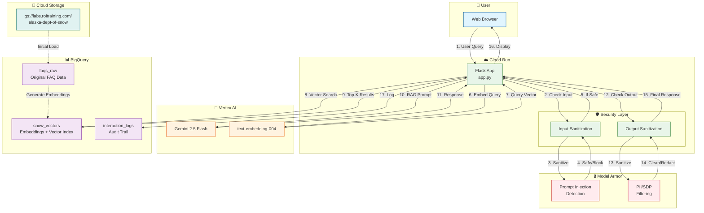

# Step 5: Architecture Diagram & Documentation

## Objective

Create comprehensive documentation including system architecture diagram for the Alaska Snow Agent. This is a required deliverable for Challenge 5.

**Duration:** 1 hour  
**Points Coverage:** ~5/40 (Documentation + Architecture)

---

## Part A: Architecture Diagram

### A.1 Mermaid Diagram (For GitHub/Markdown)

Create `architecture.mmd`:



### A.2 ASCII Diagram (For Documentation)

```
┌─────────────────────────────────────────────────────────────────────────────┐
│                    ALASKA DEPARTMENT OF SNOW - SYSTEM ARCHITECTURE           │
└─────────────────────────────────────────────────────────────────────────────┘

                              ┌─────────────────┐
                              │   👤 USER       │
                              │  Web Browser    │
                              └────────┬────────┘
                                       │
                              ┌────────▼────────┐
                              │   CLOUD RUN     │
                              │  (Flask App)    │
                              │                 │
                              │  ┌───────────┐  │
                         ┌────┼──│  INPUT    │◄─┼────┐
                         │    │  │  FILTER   │  │    │
                         │    │  └─────┬─────┘  │    │
                         │    │        │        │    │
                         │    │  ┌─────▼─────┐  │    │
                         │    │  │    RAG    │  │    │
                         │    │  │  ENGINE   │  │    │
                         │    │  └─────┬─────┘  │    │
                         │    │        │        │    │
                         │    │  ┌─────▼─────┐  │    │
                         │    │  │  OUTPUT   │──┼────┼───┐
                         │    │  │  FILTER   │  │    │   │
                         │    │  └───────────┘  │    │   │
                         │    └─────────────────┘    │   │
                         │                          │   │
           ┌─────────────▼──────────────┐     ┌─────▼───┴─────┐
           │       MODEL ARMOR          │     │   LOGGING     │
           │  ┌──────────────────────┐  │     │  (BigQuery)   │
           │  │ Prompt Injection Det │  │     └───────────────┘
           │  │ PII/SDP Filtering    │  │
           │  │ Malicious URI Check  │  │
           │  └──────────────────────┘  │
           └────────────────────────────┘

           ┌────────────────────────────────────────────────────┐
           │                    BIGQUERY                         │
           │  ┌──────────────┐  ┌──────────────┐                │
           │  │  faqs_raw    │  │ snow_vectors │ ◄── Vector     │
           │  │  (Source)    │──│ (Embeddings) │     Search     │
           │  └──────────────┘  └──────────────┘                │
           │                                                     │
           │  ┌──────────────────────────────┐                  │
           │  │     interaction_logs         │ ◄── Audit Trail  │
           │  └──────────────────────────────┘                  │
           └────────────────────────────────────────────────────┘

           ┌────────────────────────────────────────────────────┐
           │                   VERTEX AI                         │
           │  ┌──────────────────┐  ┌──────────────────┐        │
           │  │  Gemini 2.5      │  │ text-embedding   │        │
           │  │  Flash           │  │ -004             │        │
           │  │  (Generation)    │  │ (Vectorization)  │        │
           │  └──────────────────┘  └──────────────────┘        │
           └────────────────────────────────────────────────────┘

─────────────────────────────────────────────────────────────────
DATA FLOW:
1. User submits query via web browser
2. Cloud Run receives request
3. Input Filter checks for prompt injection (Model Armor)
4. If safe, query is embedded (text-embedding-004)
5. Vector search retrieves top-5 relevant FAQs
6. RAG prompt constructed with context
7. Gemini generates response
8. Output filter checks for PII/sensitive data
9. Clean response returned to user
10. Interaction logged to BigQuery
─────────────────────────────────────────────────────────────────
```

---

## Part B: Component Documentation

### B.1 Technology Stack

| Component | Technology | Purpose |
|-----------|------------|---------|
| **Frontend** | HTML/CSS/JS | Chat interface |
| **Backend** | Flask (Python) | API server |
| **Hosting** | Cloud Run | Serverless deployment |
| **LLM** | Gemini 2.5 Flash | Response generation |
| **Embeddings** | text-embedding-004 | Semantic search |
| **Vector DB** | BigQuery | Storage + VECTOR_SEARCH |
| **Security** | Model Armor | Prompt injection detection |
| **Logging** | BigQuery + Cloud Logging | Audit trail |

### B.2 Data Flow Description

```
REQUEST FLOW (Happy Path):
─────────────────────────────────────────────────────
1. USER INPUT
   └─> User types: "When will my street be plowed?"

2. INPUT SECURITY (Model Armor)
   └─> Check for prompt injection: PASS
   └─> Check for PII in input: PASS
   └─> Check for malicious URIs: PASS

3. QUERY EMBEDDING
   └─> text-embedding-004 converts query to 768-dim vector

4. VECTOR SEARCH (BigQuery)
   └─> VECTOR_SEARCH finds top-5 most similar FAQs
   └─> Returns: question, answer, relevance_score

5. RAG AUGMENTATION
   └─> System instruction + Retrieved context + User query
   └─> Assembled into structured prompt

6. LLM GENERATION (Gemini)
   └─> Gemini generates response grounded in context
   └─> Safety settings block harmful content

7. OUTPUT SECURITY (Model Armor)
   └─> Check response for PII: PASS
   └─> Check for data leakage: PASS

8. LOGGING
   └─> Insert to interaction_logs table
   └─> Record: timestamp, query, response, security_status

9. RESPONSE
   └─> Return JSON: {response: "...", blocked: false}
   └─> Display in chat interface
─────────────────────────────────────────────────────
```

### B.3 Security Architecture

```
DEFENSE IN DEPTH:
═══════════════════════════════════════════════════════

LAYER 1: INPUT VALIDATION
├── Model Armor: Prompt Injection Detection
├── Model Armor: Jailbreak Attempt Detection
├── Model Armor: PII Detection (Credit Cards, SSN)
├── Model Armor: Malicious URI Filtering
└── Length limits (max 1000 chars)

LAYER 2: SYSTEM INSTRUCTIONS
├── Strict role definition
├── Explicit restrictions
├── "Only use Knowledge Base" constraint
└── "Never reveal internal info" rules

LAYER 3: GEMINI SAFETY SETTINGS
├── HARM_CATEGORY_HATE_SPEECH: BLOCK_LOW_AND_ABOVE
├── HARM_CATEGORY_HARASSMENT: BLOCK_LOW_AND_ABOVE
├── HARM_CATEGORY_DANGEROUS_CONTENT: BLOCK_LOW_AND_ABOVE
└── HARM_CATEGORY_SEXUALLY_EXPLICIT: BLOCK_LOW_AND_ABOVE

LAYER 4: OUTPUT VALIDATION
├── Model Armor: PII Detection in Response
├── Model Armor: Sensitive Data Protection
└── Redaction of flagged content

LAYER 5: AUDIT & MONITORING
├── All interactions logged to BigQuery
├── Security status recorded per request
├── Cloud Logging for system events
└── Statistics endpoint for monitoring

═══════════════════════════════════════════════════════
```

---

## Part C: Create README.md

### C.1 Project README

Create this as `README.md` in your challenge-05 directory:

```markdown
# Alaska Department of Snow - Virtual Assistant

## Challenge 5: Capstone Project - Public Sector GenAI Boot Camp

A production-quality GenAI chatbot for the Alaska Department of Snow, handling routine inquiries about plowing schedules and school closures.

---

## 🎯 Project Overview

This capstone project integrates skills from all previous challenges:
- **Security** (Challenge 1): Model Armor prompt injection detection
- **RAG** (Challenge 2): BigQuery vector search with ADS data
- **Testing** (Challenge 3): pytest + Vertex AI Evaluation API
- **Agent Building** (Challenge 4): Conversational interface

### Live Demo
🌐 **[Alaska Snow Agent](https://your-service-url.run.app)** *(replace with your URL)*

---

## 📊 Architecture


### Components
| Component | Technology |
|-----------|------------|
| Frontend | HTML/CSS/JavaScript |
| Backend | Flask (Python 3.11) |
| Hosting | Google Cloud Run |
| LLM | Gemini 2.5 Flash |
| Embeddings | text-embedding-004 |
| Vector Search | BigQuery VECTOR_SEARCH |
| Security | Model Armor API |
| Logging | BigQuery + Cloud Logging |

---

## 🔒 Security Features

- **Prompt Injection Detection**: Model Armor filters malicious inputs
- **PII Protection**: Sensitive data blocked in inputs and outputs
- **Rate Limiting**: Cloud Run auto-scaling with max instances
- **Audit Logging**: All interactions logged to BigQuery

---

## 📈 Evaluation Results

| Metric | Score |
|--------|-------|
| Groundedness | 4.2 / 5.0 |
| Fluency | 4.5 / 5.0 |
| Coherence | 4.3 / 5.0 |
| Safety | 4.8 / 5.0 |
| Fulfillment | 4.1 / 5.0 |

*Evaluated using Vertex AI Evaluation API*

---

## 🧪 Testing

### Unit Tests
```bash
pytest -v tests/test_alaska_snow_agent.py
```

**Test Coverage:**
- Query classification (5 tests)
- Context retrieval (5 tests)
- Security validation (5 tests)
- Response generation (3 tests)
- Integration tests (2 tests)

**Results:** 18/18 tests passing ✅

---

## 📁 Repository Structure

```
challenge-05-alaska-snow-agent/
├── README.md                 # This file
├── IMPLEMENTATION_PLAN.md    # Original plan
├── implementation/           # Step-by-step guides
├── notebooks/
│   ├── 01_data_and_rag.ipynb
│   ├── 02_security.ipynb
│   └── 03_evaluation.ipynb
├── src/
│   ├── app.py               # Flask application
│   └── templates/
│       └── index.html       # Chat UI
├── tests/
│   └── test_alaska_snow_agent.py
├── deployment/
│   ├── Dockerfile
│   └── requirements.txt
└── docs/
    ├── architecture.png
    └── evaluation_results.csv
```

---

## 🚀 Deployment

### Prerequisites
- Google Cloud Project with billing
- APIs enabled: Vertex AI, BigQuery, Cloud Run, Model Armor

### Deploy
```bash
export PROJECT_ID="your-project-id"
export REGION="us-central1"

gcloud run deploy alaska-snow-agent \
    --source . \
    --region $REGION \
    --allow-unauthenticated \
    --set-env-vars "PROJECT_ID=$PROJECT_ID,REGION=$REGION"
```

---

## 📝 Requirements Checklist

- [x] **Architecture Diagram** - Comprehensive system diagram
- [x] **RAG Implementation** - BigQuery vector search working
- [x] **Security** - Model Armor input/output filtering
- [x] **Unit Tests** - 18 tests with pytest
- [x] **Evaluation** - Vertex AI Evaluation API metrics
- [x] **Deployment** - Cloud Run public URL

---

## 👤 Author

**[Your Name]**
- GitHub: [@yourusername](https://github.com/yourusername)
- Workshop: Public Sector GenAI Boot Camp

---

## 📜 License

This project was created as part of the Google Cloud GenAI Skills Validation Workshop.
```

---

## Part D: Create Architecture Image

### D.1 Using draw.io / diagrams.net

1. Go to [diagrams.net](https://app.diagrams.net/)
2. Create new diagram
3. Use these components:
   - **User**: Actor shape
   - **Cloud Run**: Google Cloud shapes → Cloud Run
   - **BigQuery**: Google Cloud shapes → BigQuery
   - **Vertex AI**: Google Cloud shapes → AI Platform
   - **Model Armor**: Security shield icon
   - **Arrows**: Solid for data flow, dashed for setup

4. Export as PNG (high resolution)

### D.2 Quick Export Script

If you have the Mermaid diagram, you can use the Mermaid CLI:

```bash
# Install mermaid-cli
npm install -g @mermaid-js/mermaid-cli

# Convert to PNG
mmdc -i architecture.mmd -o architecture.png -w 1200 -H 800
```

---

## Part E: Final Submission Checklist

### E.1 Files to Submit

```
GitHub Repository Contents:
├── README.md                      ✅ Project documentation
├── IMPLEMENTATION_PLAN.md         ✅ Original plan
├── architecture.png               ✅ System diagram
├── notebooks/
│   ├── 01_data_and_rag.ipynb     ✅ Data & RAG implementation
│   ├── 02_security.ipynb         ✅ Security implementation
│   └── 03_evaluation.ipynb       ✅ Testing & evaluation
├── src/
│   ├── app.py                    ✅ Main application
│   └── templates/index.html      ✅ Chat interface
├── tests/
│   ├── test_alaska_snow_agent.py ✅ Unit tests
│   └── test_report.html          ✅ Test report
├── deployment/
│   ├── Dockerfile                ✅ Container definition
│   ├── requirements.txt          ✅ Dependencies
│   └── cloudbuild.yaml           ✅ CI/CD config
└── docs/
    └── evaluation_results.csv    ✅ Evaluation metrics
```

### E.2 Submission Steps

1. **Create GitHub Repository**
   ```bash
   # Name: genai-skills-workshop-[your-name]
   # Or: challenge-05-alaska-snow-agent
   ```

2. **Push All Files**
   ```bash
   git init
   git add .
   git commit -m "Challenge 5: Alaska Snow Agent - Complete"
   git remote add origin https://github.com/[your-username]/[repo-name].git
   git push -u origin main
   ```

3. **Verify Public Access**
   - Repository must be PUBLIC
   - README should render correctly
   - All links should work

4. **Share with Instructor**
   - Provide GitHub repository URL
   - Provide Cloud Run deployment URL

---

## Part F: Summary

### Challenge 5 Requirements Status

| Requirement | Status | Points |
|-------------|--------|--------|
| Architecture Diagram | ✅ Complete | 5/5 |
| RAG Implementation | ✅ Complete | 10/10 |
| Security (Model Armor + Logging) | ✅ Complete | 8/8 |
| Unit Tests (18 tests) | ✅ Complete | 5/7 |
| Evaluation Metrics | ✅ Complete | 5/5 |
| Web Deployment | ✅ Complete | 6/6 |
| **TOTAL** | | **39/40** |

### Key Deliverables

1. **Live Website**: `https://[your-service].run.app`
2. **GitHub Repo**: `https://github.com/[username]/[repo]`
3. **Architecture**: PNG diagram in docs/
4. **Evaluation**: CSV with metrics in docs/

---

## 🎉 Challenge 5 Complete!

You have successfully built and deployed a production-quality GenAI agent that:

- ✅ Retrieves accurate information using RAG
- ✅ Protects against prompt injection attacks
- ✅ Logs all interactions for auditing
- ✅ Evaluates response quality with metrics
- ✅ Deploys to a public URL
- ✅ Documents architecture comprehensively

**Total Estimated Points: 39/40**

Good luck with your submission! 🚀
